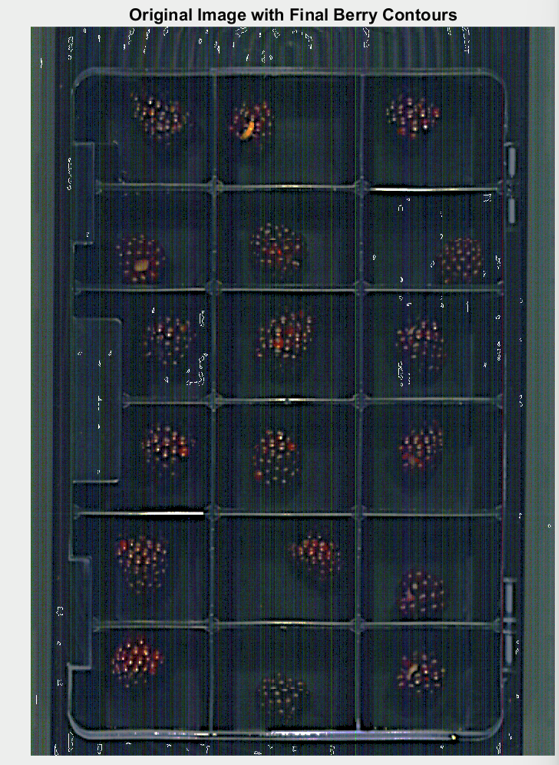
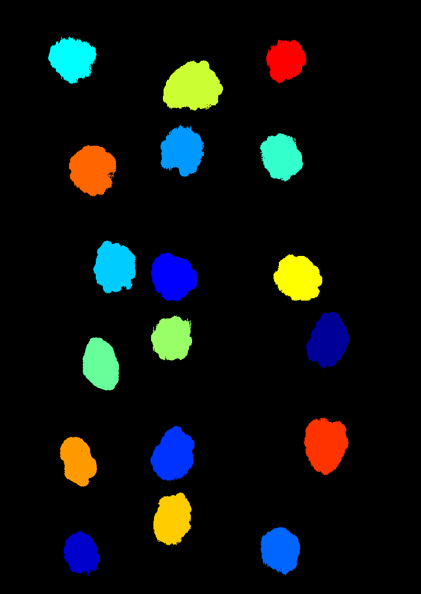
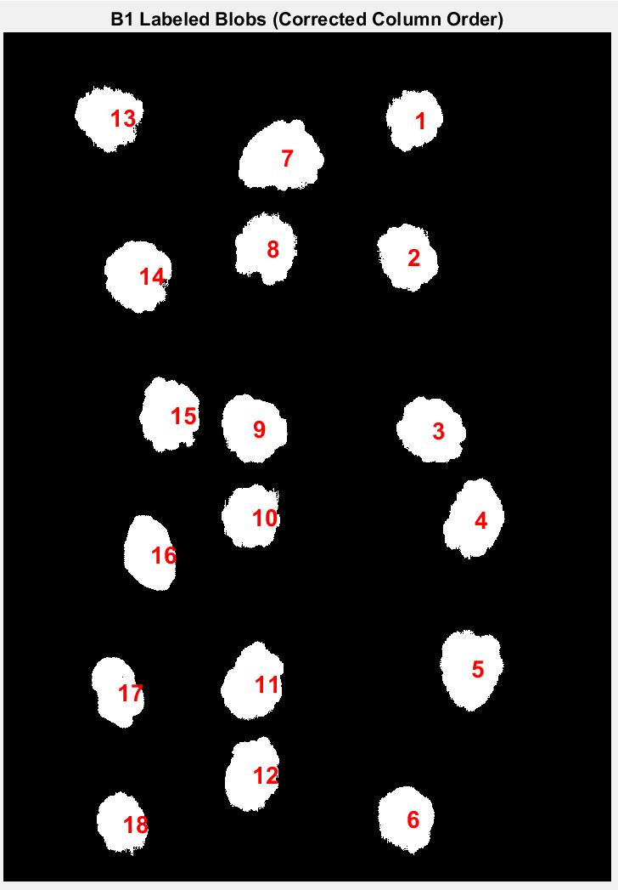
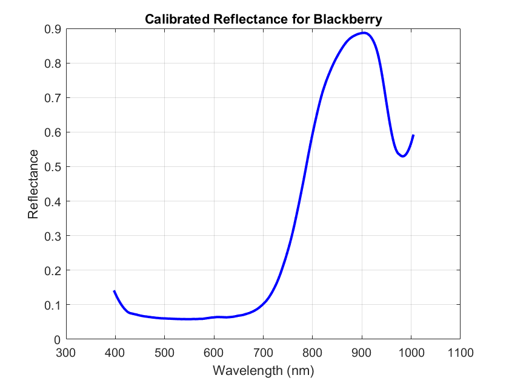
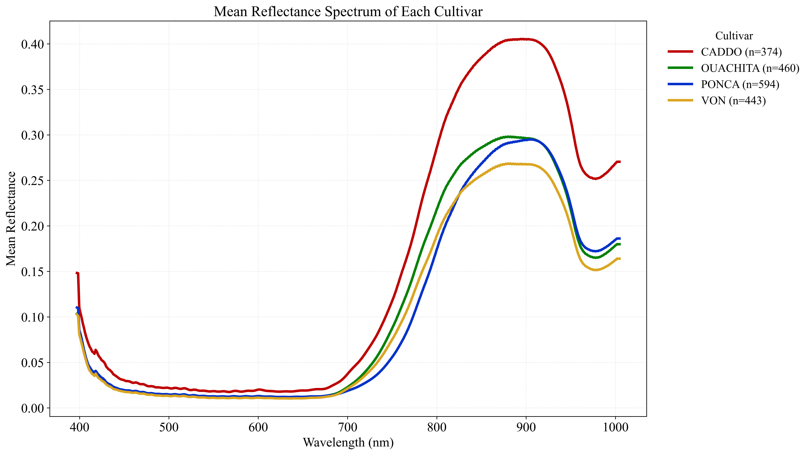

# 🫐 Blackberries — Hyperspectral Imaging

**Target:** Per-berry spectral characterisation — TSS (°Brix), ripeness, quality  
**Camera:** Specim FX10e — VIS Push-broom HSI, 400–1000 nm, 448 bands  
**Lab:** SAFE Lab, University of Arkansas

---

## Overview

This sub-project processes hyperspectral image cubes of blackberry fruit arranged in trays (boxes B1–B7, up to 18 berries per box, 120 berries total). Each berry is individually segmented, labelled with a unique ID, and its calibrated reflectance spectrum is extracted for downstream quality prediction (TSS, °Brix, firmness).

The pipeline runs in three stages — **segmentation → labelling → spectral extraction** — each with its own script.

---

## 📸 Sample Outputs

<table>
  <tr>
    <td align="center"><b>Original Berry Image</b></td>
    <td align="center"><b>Auto Segmentation</b></td>
    <td align="center"><b>Auto Berry Labelling</b></td>
  </tr>
  <tr>
    <td></td>
    <td></td>
    <td></td>
  </tr>
  <tr>
    <td align="center"><em>Raw RGB image — Specim FX10e. Berries arranged in 3-column grid (18 per box).</em></td>
    <td align="center"><em>Colour-coded connected components after circularity filtering.</em></td>
    <td align="center"><em>Berry IDs (1–120) sorted right→middle→left, top→bottom.</em></td>
  </tr>
</table>

<table>
  <tr>
    <td align="center"><b>Single Berry Reflectance Spectrum</b></td>
  </tr>
  <tr>
    <td></td>
  </tr>
  <tr>
    <td align="center"><em>Mean calibrated reflectance (430–1000 nm) after Savitzky-Golay smoothing.</em></td>
  </tr>
</table>

<table>
  <tr>
    <td align="center"><b>Spectral Reflectance Curve for Different Cultivers.</b></td>
    <td align="center"><b>Mean Spectral Reflectance Curve.</b></td>
  </tr>
  <tr>
    <td></td>
    <td></td>
  </tr>
</table>
> 📥 **[Download Sample Dataset (Google Drive)](https://drive.google.com/drive/folders/1p9c1barmlBz4l13Q3Wc0V8V5tfAg2Dyi?usp=drive_link)**  
> Extract into your data root folder and update `SAMPLE_NAME` in the USER CONFIGURATION block to run the pipeline on this sample.

---

## 📄 Scripts

| Script | Stage | Mode | Description |
|---|---|---|---|
| `blackberry_segmentation.m` | 1 — Segmentation | Batch | Applies adaptive histogram equalisation + circularity filter to isolate individual berry blobs; saves binary masks and green overlays |
| `custom_blackberry_segmentation.m` | 1 — Segmentation | Interactive | Same auto-segmentation as above, but opens an interactive GUI brush tool (A=add, E=erase, slider=brush size) for manual mask correction; use when auto-segmentation misses or merges berries |
| `labeling_blackberry.m` | 2 — Labelling | Batch | Reads binary masks, labels each berry blob with its physical box ID (1–120) sorted right→middle→left; saves labelled PNG images |
| `single_berry_extract_data.m` | 3 — Extraction | Single sample | Segments one scan, calibrates, extracts spectra from circular berry mask — good for spot-checking a new dataset |
| `berry_batch_extraction_optimized.m` | 3 — Extraction | Batch | Most optimised batch pipeline — wavelength cropping (430–1000 nm), vectorized median extraction, per-berry BW preview, saves stacks + 4 graph types |
| `berry_batch_extraction_full.m` | 3 — Extraction | Batch | Same batch loop but loads dark/white refs from the **same folder** as each sample; saves per-berry MAT+CSV for raw, dark, and white in addition to calibrated reflectance |

---

## Which Extraction Script Should I Use?

| Situation | Use |
|---|---|
| Each dataset has its own dark/white references captured alongside it | `berry_batch_extraction_full.m` |
| References are shared across a session (one ref set for all boxes) | `berry_batch_extraction_optimized.m` |
| Exploring a single scan or checking segmentation | `single_berry_extract_data.m` |

---

## Pipeline

```
RGB Images (.png)
      │
      ▼
blackberry_segmentation.m          → circular_masks/ + circular_overlays/
      │  (or custom_blackberry_segmentation.m for manual correction)
      ▼
labeling_blackberry.m              → <folder>_labeled.png (berry IDs 1–120)
      │
      ▼
single_berry_extract_data.m        → E_smoothed (single scan, workspace)
  OR
berry_batch_extraction_optimized.m → stacks + graphs (shared refs)
  OR
berry_batch_extraction_full.m      → stacks + graphs + per-berry raw/dark/white (per-sample refs)
```

---

## 🗂️ Expected Data Structure

```
<base_folder>/
└── Caddo/
    └── Caddo_Row_06_2025-06-24/
        └── Anthony_Caddo_2025_06_24_0741_06_B1_2025-06-24_18-00-28/
            ├── Anthony_Caddo_..._B1_....png     ← binary mask image (same name as folder)
            └── capture/
                ├── Anthony_Caddo_..._B1_....hdr / .raw     ← raw HSI cube
                ├── DARKREF_Anthony_Caddo_..._B1_....hdr / .raw
                └── WHITEREF_Anthony_Caddo_..._B1_....hdr / .raw
```

**Folder naming convention:**
```
Anthony_<Variety>_<Date>_<Time>_<Row>_<BoxID>_<Timestamp>
Example: Anthony_Caddo_2025_06_24_0741_06_B1_2025-06-24_18-00-28
```
Box IDs: B1–B6 (18 berries each, 3 columns × 6 rows), B7 (12 berries, 2 columns × 6 rows)

---

## ⚙️ Configuration

Each script has a **USER CONFIGURATION** block at the top — the only section you need to edit. Set your local folder paths and the parameters below:

### Segmentation scripts
```matlab
input_folder          = 'your\path\to\Blackberry_images\';
MIN_AREA              = 1500;    % minimum berry blob size in pixels
CIRCULARITY_THRESHOLD = 0.3;     % 0 = any shape, 1 = perfect circle
```

### Labelling script
```matlab
base_folder = 'your\path\to\Blackberry_data\';
```

### Single-sample extraction
```matlab
DATA_ROOT   = "your\path\to\dataset\row\folder\";
SAMPLE_NAME = "your_sample_folder_name";
IMG_NAME    = "your_rgb_image_name";
```

### Batch extraction scripts
```matlab
base_folder = 'your\path\to\Blackberry_data\';
```

---

## 🚀 Quick Start

```matlab
cd('C:\Hyperspectral-Imaging\Blackberries')

% Step 1: Auto-segment all berry images
run('blackberry_segmentation.m')

% Step 1b (optional): Manual correction for any difficult images
run('custom_blackberry_segmentation.m')

% Step 2: Label each berry with its physical box ID
run('labeling_blackberry.m')

% Step 3a: Batch extract (per-sample refs, most complete output)
run('berry_batch_extraction_full.m')

% Step 3b: OR batch extract (shared refs, optimised/faster)
run('berry_batch_extraction_optimized.m')
```

---

## 📊 Output Variables & Files

### Single-sample script (workspace)

| Variable | Size | Description |
|---|---|---|
| `circular_mask` | H × W | Binary berry mask |
| `calibrated_data` | H × W × Bands | Calibrated reflectance cube |
| `extracted_data` | Bands × N\_pixels | Per-pixel spectra |
| `E` | Bands × 1 | Raw mean spectrum |
| `E_smoothed` | Bands × 1 | SG-smoothed mean spectrum |

### Batch scripts (saved per Anthony folder)

| Output | Folder | Description |
|---|---|---|
| `stack_<B#>.mat` | `data/` | All 4 stacks: reflectance, raw, dark, white |
| `stack_<B#>_reflectance.csv` | `data/` | Per-berry smoothed reflectance (Bands × N_berries) |
| `stack_<B#>_raw.csv` | `data/` | Per-berry raw intensity |
| `<name>_graph.png` | `graph/` | Per-berry reflectance plot |
| `<name>_raw.png` | `raw_graphs/` | Per-berry raw intensity plot |
| `<name>_dark.png` | `dark_graphs/` | Dark reference plot |
| `<name>_white.png` | `white_graphs/` | White reference plot |
| `<name>_label.png` | `label/` | Mask with berry ID overlay |
| `<name>_raw.mat/.csv` | `data_raw/` | Per-berry E_raw + wavelength *(full script only)* |
| `<name>_dark.mat/.csv` | `data_dark/` | Per-berry E_dark + wavelength *(full script only)* |
| `<name>_white.mat/.csv` | `data_white/` | Per-berry E_white + wavelength *(full script only)* |

---

## 🗂️ Archived Scripts

The following scripts were development experiments and are kept for reference in the `archive/` folder:

| Script | Reason archived |
|---|---|
| `Test_1_Berry_Seg.m` | Experimental — circularity + clustering + edge/entropy maps, not used in final pipeline |
| `Test_2_Berry_Seg.m` | Experimental — Bresenham centroid connection approach |
| `Test_3_Berry_Seg.m` | Experimental — graythresh + dilation blob connection |
| `Berry_spectral_extraction.m` | Superseded by `berry_batch_extraction_full.m` |
| `Berry_spectral_extraction2.m` | Superseded by `berry_batch_extraction_optimized.m` |

---

## 📬 Contact

Chaitanya Pallerla — `pallerla@uark.edu`  
[← Back to main repository](../README.md)
