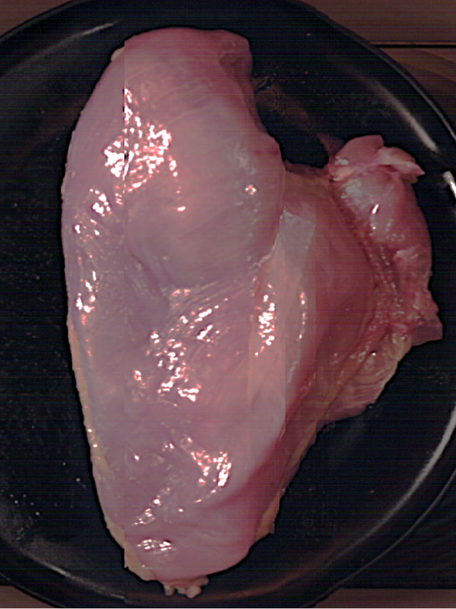
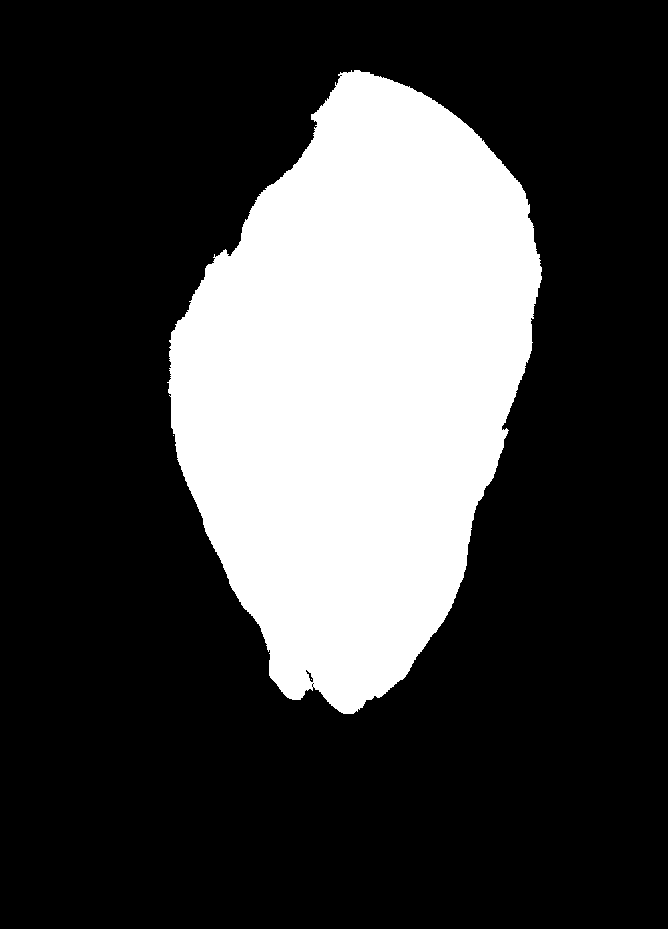
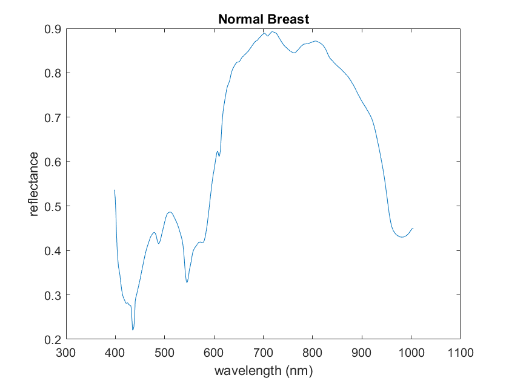

# 🍗 Chicken Breast Fillets — Hyperspectral Imaging

**Target:** Poultry myopathy classification — Normal (NB), Woody Breast (WB), Spaghetti Meat (ST)  
**Camera:** Specim FX10e — VIS Push-broom HSI, 400–1000 nm, 448 bands  
**Lab:** SAFE Lab, University of Arkansas

---

## Overview

This sub-project processes hyperspectral image cubes of raw chicken breast fillets to extract per-pixel reflectance spectra for myopathy classification. Myopathies such as **Woody Breast (WB)** and **Spaghetti Meat (ST)** alter the muscle fibre structure and water-binding capacity of the fillet, producing measurable spectral differences across 400–1000 nm that are invisible to the naked eye.

Two scripts are provided — one for **single-sample** exploration and one for **automated batch processing** of a full dataset folder.

---

## 📸 Sample Data

<table>
  <tr>
    <td align="center"><b>RGB Preview</b></td>
    <td align="center"><b>Segmented Mask</b></td>
    <td align="center"><b>Mean Reflectance Spectrum</b></td>
  </tr>
  <tr>
    <td></td>
    <td></td>
    <td></td>
  </tr>
  <tr>
    <td align="center"><em>Normal breast fillet — Specim FX10e.</em></td>
    <td align="center"><em>Otsu threshold + hole fill + noise removal.</em></td>
    <td align="center"><em>400–1000 nm, SG smoothed (window=41, order=2).</em></td>
  </tr>
</table>

> 📥 **[Download Sample Dataset — Chai_Chai_Normal_Chicken_14_Right_11192022.zip (Google Drive)](https://drive.google.com/file/d/1rPGqgWL6uQZUAtxL6OM_ktbX96gPs6V_/view?usp=drive_link)**  
> Extract it into your `DATA_ROOT` folder and set `SAMPLE_NAME` accordingly to run the pipeline on this sample.

## 📄 Scripts

| Script | Mode | Description |
|---|---|---|
| `chicken_breast_hsi_pipeline.m` | Single sample | Load one sample by name, segment fillet, calibrate, extract ROI spectra, smooth, plot — good for exploring a new dataset or verifying results |
| `Loop_Adaptive_Crop_Chicken.m` | Batch — all samples | Auto-detects every dataset folder under `base_path`, segments each fillet, applies adaptive crop, calibrates, extracts, saves CSV / MAT / plots for every sample automatically |
| `Loop_Chicken.m` | Batch — simplified | Same batch loop without adaptive crop — uses full image mask directly, references captured in the same folder as each sample |

---

## Pipeline

```
RGB Preview (.png)
      │
      ▼
Grayscale → Otsu Threshold → Fill Holes → Remove Noise
      │                      (bwareaopen, imclearborder)
      ▼
Remove Thin Horizontal Bars → Keep Largest Component → Binary Mask (BW)
      │
      ▼                            [Batch only]
Adaptive Bounding Box Crop  ←──────────────────────────
      │
      ▼
Load ENVI Cube (.hdr / .raw)  +  Dark & White References
      │
      ▼
Calibration:  (Raw − Dark) / (White − Dark)
      │
      ▼
Apply BW Mask → Extract ROI Pixel Spectra per Band
      │
      ▼
Mean Spectrum → Savitzky-Golay Smoothing (window=41, order=2)
      │
      ▼
Save CSV / MAT / Plots   [Batch]   or   Interactive Plot   [Single]
```

---

## 🗂️ Expected Data Structure

### Single-sample script (`chicken_breast_hsi_pipeline.m`)
Dark and white references can come from a **different session folder** (`REF_NAME`) — this is normal when references are shared across multiple samples captured in the same imaging session.

```
<DATA_ROOT>/
├── <SAMPLE_NAME>/
│   ├── <SAMPLE_NAME>.png
│   └── capture/
│       ├── <SAMPLE_NAME>.hdr
│       └── <SAMPLE_NAME>.raw
└── <REF_NAME>/
    └── capture/
        ├── DARKREF_<REF_NAME>.hdr / .raw
        └── WHITEREF_<REF_NAME>.hdr / .raw
```

### Batch script (`Loop_Adaptive_Crop_Chicken.m`)
References live in a separate `base_path1` folder. The script auto-discovers all subfolders under `base_path` and processes them all.

```
<base_path>/                          ← all sample folders here
    ├── sample_001/
    │   ├── sample_001.png
    │   └── capture/  (.hdr / .raw)
    ├── sample_002/
    │   └── ...
    └── ...

<base_path1>/                         ← reference folder (separate location)
    └── <REF_NAME>/
        └── capture/
            ├── DARKREF_<REF_NAME>.hdr / .raw
            └── WHITEREF_<REF_NAME>.hdr / .raw

<output_root>/                        ← all outputs saved here automatically
    ├── BW_masks/
    ├── Mean_Data/           ← .csv, .mat, .m per sample
    ├── Mean_Plots/          ← reflectance plot per sample
    ├── White_Ref_Plots/
    └── Dark_Ref_Plots/
```

---

## ⚙️ Configuration

### Single-sample script
Edit the **USER CONFIGURATION** block at the top — 3 variables only:

```matlab
DATA_ROOT   = "\your data folder path";        % <-- your data folder
SAMPLE_NAME = "your sample name";     % <-- sample to process
```

### Batch script
Edit the paths block at the top:

```matlab
base_path     = "\your data folder path";       % <-- folder with all samples
output_root   = "C:\Users\YourName\Downloads\outputs\";  % <-- where to save results
base_path1    = "C:\Users\YourName\Downloads\";          % <-- folder with references
```

---

## 🚀 Quick Start

**Single sample:**
```matlab
cd('C:\Hyperspectral-Imaging\Chicken-Breast-Fillets')
% Edit USER CONFIGURATION at the top, then:
run('chicken_breast_hsi_pipeline.m')
```

**Batch processing:**
```matlab
cd('C:\Hyperspectral-Imaging\Chicken-Breast-Fillets')
% Edit the 4 path variables at the top, then:
run('Loop_Adaptive_Crop_Chicken.m')
% Outputs (CSV, MAT, PNG plots) saved automatically to output_root
```

---

## 📊 Output Variables

### Single-sample script

| Variable | Size | Description |
|---|---|---|
| `BW` | H × W | Binary mask — 1 = fillet ROI, 0 = background |
| `calibrated_data` | H × W × 448 | Calibrated reflectance cube |
| `extracted_data` | 448 × N\_pixels | Per-pixel spectra for all ROI pixels |
| `E` | 448 × 1 | Raw mean spectrum |
| `E_smoothed` | 448 × 1 | SG-smoothed mean spectrum |

### Batch script (saved per sample to `output_root`)

| Output | Format | Description |
|---|---|---|
| `<name>_BW.png` | PNG | Binary segmentation mask |
| `<name>_mean.csv` | CSV | Wavelength, mean, smoothed columns |
| `<name>_mean.mat` | MAT | `E`, `E_smooth`, `raw_info` workspace variables |
| `<name>_mean.m` | .m | Hardcoded wavelength + spectrum arrays (for plotting without reloading data) |
| `<name>_mean.png` | PNG | Smoothed reflectance plot |
| `<name>_white.png` | PNG | White reference spectrum plot |
| `<name>_dark.png` | PNG | Dark reference spectrum plot |

---

## 🔬 Key Differences Between the Two Scripts

| Feature | `chicken_breast_hsi_pipeline.m` | `Loop_Adaptive_Crop_Chicken.m` |
|---|---|---|
| Mode | Single sample | Full folder batch |
| Crop | None — uses full image | Adaptive bounding box around fillet |
| Border removal | No | Yes — `imclearborder` removes edge-touching objects |
| Thin bar removal | No | Yes — removes horizontal conveyor artifacts |
| Output | Workspace variables + interactive plot | CSV, MAT, .m, and PNG per sample auto-saved |

---

## 📬 Contact

Chaitanya Pallerla — `pallerla@uark.edu`  
[← Back to main repository](../README.md)
