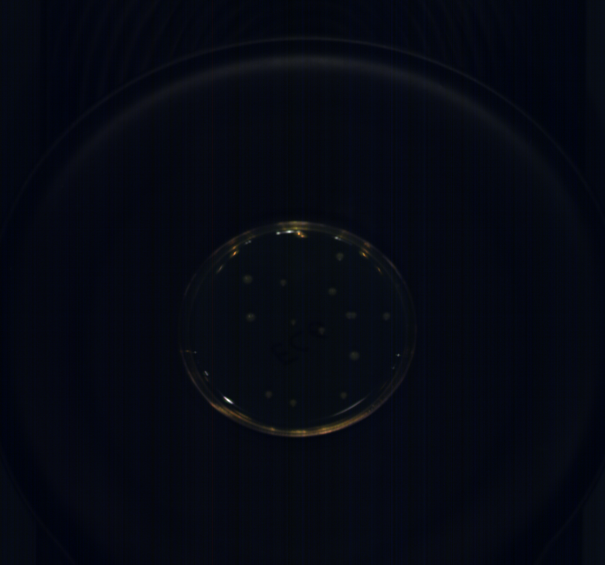
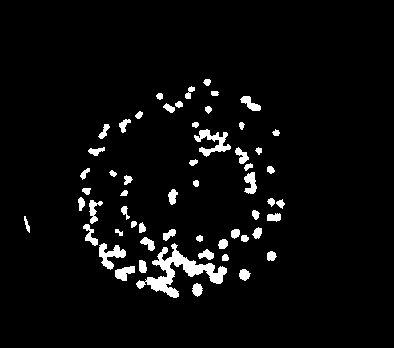
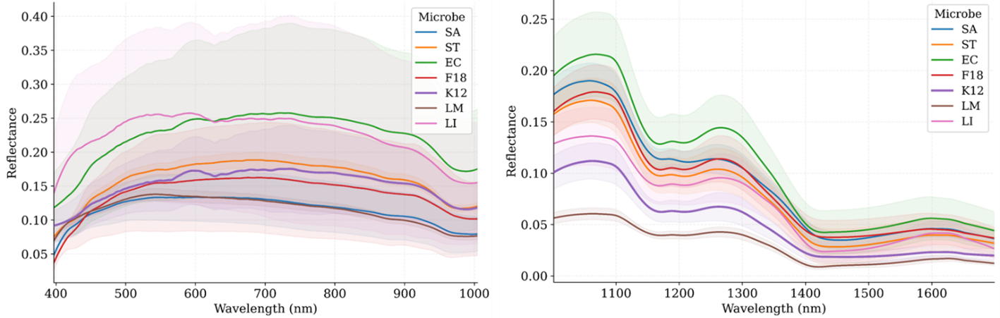

# 🧫 Microbial Colonies — Hyperspectral Imaging

**Target:** Per-colony microbial species classification  
**Camera:** Specim FX10e (VIS 400–1000 nm, 448 bands) + Specim FX17 (NIR 1000–1700 nm, 224 bands)  
**Lab:** SAFE Lab, University of Arkansas

---

## Overview

This sub-project processes hyperspectral image cubes of microbial agar plates to extract per-colony reflectance spectra for species classification. Each colony is individually segmented from the agar background using CLAHE contrast enhancement and inverted Otsu thresholding, and its calibrated spectrum is extracted and smoothed.

Both VIS (400–1000 nm) and NIR (1000–1700 nm) ranges are processed with dedicated scripts. Both are **fully automated batch pipelines** — they auto-detect all `Yang_*` dataset folders and process them without any manual steps per sample.

---

## 📸 Sample Outputs

### Agar Plate — Original & Segmented

<table>
  <tr>
    <td align="center"><b>Original Image</b></td>
    <td align="center"><b>Segmented Colonies</b></td>
  </tr>
  <tr>
    <td></td>
    <td></td>
  </tr>
  <tr>
    <td align="center"><em>RGB preview captured with the Specim FX10e.</em></td>
    <td align="center"><em>Binary mask after CLAHE + inverted Otsu + area filter.</em></td>
  </tr>
</table>

### Per-Colony Reflectance Spectrum

*Mean calibrated reflectance spectrum per colony after Savitzky-Golay smoothing.*

---

## 📄 Scripts

| Script | Sensor | Bands | Description |
|---|---|---|---|
| `microbial_extraction_VIS_400_1000nm.m` | Specim FX10e | 448 | Batch VIS pipeline — segments colonies, calibrates, extracts per-colony spectra (400–1000 nm), saves stacked outputs |
| `microbial_extraction_NIR_1000_1700nm.m` | Specim FX17 | 224 | Batch NIR pipeline — same workflow for the 1000–1700 nm range; resamples to exactly 224 bands if needed |

Both scripts are **identical in structure** — the only differences are the wavelength range, target band count, and SG window size.

---

## Pipeline

```
Yang_* dataset folders (auto-detected)
      │
      ▼
Load RGB PNG → Grayscale → CLAHE contrast enhancement
      │
      ▼
Inverted Otsu threshold → Fill holes → Area filter
(keep colonies 5–5000 px, discard agar background)
      │
      ▼
Load ENVI cube (.hdr/.raw) + Dark + White references
      │
      ▼
Calibration: (Raw − Dark) / (White − Dark)
      │
      ▼
Crop to wavelength range (400–1000 nm OR 1000–1700 nm)
Resample to target band count (448 OR 224) if needed
      │
      ▼
Per-colony binary mask → extract pixel spectra
      │
      ▼
Mean spectrum → Savitzky-Golay smoothing
      │
      ▼
Save per-colony: .mat, .csv, plot
Save stacked matrix: .mat, .csv, plot
Save reference plots: dark, white
```

---

## 🗂️ Expected Data Structure

```
<root_path>/
└── Yang_<species>_<date>/
    ├── Yang_<species>_<date>.png       ← RGB preview image
    └── capture/
        ├── Yang_<species>_<date>.hdr   ← Raw cube header (ENVI)
        ├── Yang_<species>_<date>.raw   ← Raw cube data
        ├── DARKREF_Yang_....hdr / .raw ← Dark reference
        └── WHITEREF_Yang_....hdr / .raw← White reference
```

---

## ⚙️ Configuration

Both scripts have a **USER CONFIGURATION** block at the top — only these need changing:

```matlab
root_path       = 'your\path\to\Yang_datasets\';  % folder with all Yang_* subfolders
out_root        = fullfile(root_path, 'Processed_output\');

MIN_COLONY_AREA = 5;      % minimum colony size in pixels
MAX_COLONY_AREA = 5000;   % maximum colony size in pixels

SG_WINDOW = 31;   % Savitzky-Golay window (NIR) — must be odd
SG_WINDOW = 51;   % Savitzky-Golay window (VIS) — must be odd
SG_ORDER  = 2;
```

---

## 🚀 Quick Start

```matlab
cd('C:\Hyperspectral-Imaging\Microbial-Colonies')

% VIS 400-1000 nm
microbial_extraction_VIS_400_1000nm()

% NIR 1000-1700 nm
microbial_extraction_NIR_1000_1700nm()
```

> Note: both scripts are MATLAB functions — call them by name rather than using `run()`.

---

## 📊 Output Structure (per Yang_* dataset)

```
Processed_output/
└── Yang_<name>/
    ├── reference_graphs/
    │   ├── dark_reference.png
    │   └── white_reference.png
    ├── BW_Img/
    │   └── BW_colony_001.png ... BW_colony_NNN.png
    ├── data/
    │   ├── E_<name>_colony_1_<range>_<bands>b.mat / .csv
    │   ├── ...
    │   ├── stacked_<name>_<range>_<bands>b.mat / .csv
    │   └── wavelengths_<name>_<range>_<bands>b.mat / .csv
    ├── Graph_of_each_colony/
    │   └── E_<name>_colony_1_<range>_<bands>b.png ...
    └── stacked_data/
        ├── overall_BW.png
        ├── stacked_<name>_<range>_<bands>b.mat / .csv
        └── stacked_<name>_<range>_<bands>b.png
```

---

## 🔬 Key Differences Between VIS and NIR Scripts

| Feature | VIS (400–1000 nm) | NIR (1000–1700 nm) |
|---|---|---|
| Sensor | Specim FX10e | Specim FX17 |
| Target bands | 448 | 224 |
| SG window | 51 | 31 |
| Extraction method | Band-by-band loop | Vectorized reshape |
| File suffix | `_400_1000nm_448b` | `_1000_1700nm_224b` |

---

## 📥 Sample Data

| Dataset | Sensor | Download |
|---|---|---|
| E. coli — VIS 400–1000 nm | Specim FX10e (448 bands) | **[Download from Google Drive](https://drive.google.com/drive/folders/1idd5-2sESb7mXl9R1JpqJVkQZiGJL_Z6?usp=drive_link)** |
| E. coli — NIR 1000–1700 nm | Specim FX17 (224 bands) | **[Download from Google Drive](https://drive.google.com/drive/folders/1c2ikAKv7D1nBEV3EtF6j1WQkDBsqAAwg?usp=drive_link)** |

> Extract each folder into your `root_path` directory. The folder names follow the `Yang_*` naming convention and will be auto-detected by both scripts.

---

## 📬 Contact

Chaitanya Pallerla — `pallerla@uark.edu`  
[← Back to main repository](../README.md)
