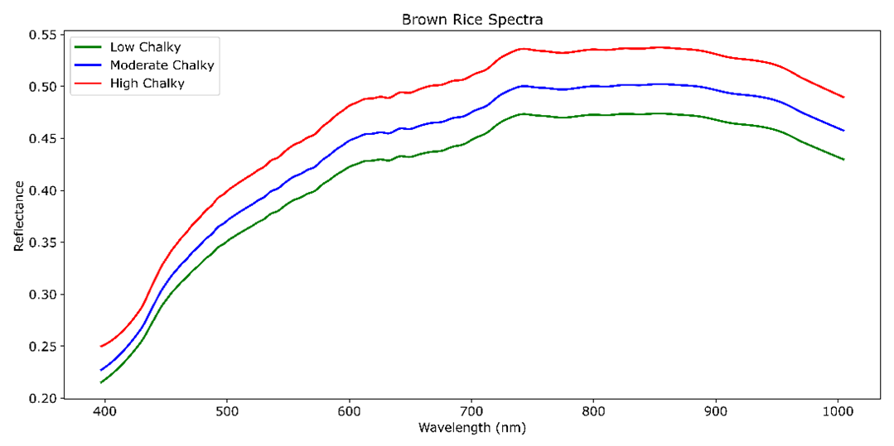
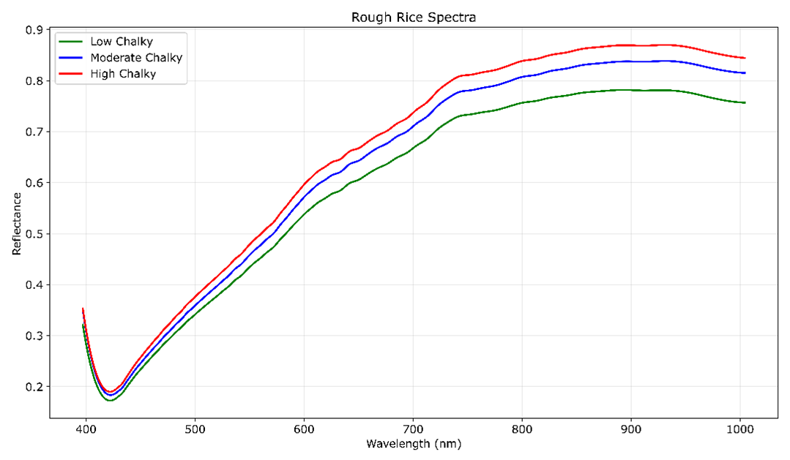

# 🌾 Rice — Hyperspectral Imaging

**Target:** Grain-level chalkiness and quality classification — Brown Rice, Rough Rice  
**Camera:** Specim FX10e — VIS Push-broom HSI, 400–1000 nm, 448 bands  
**Lab:** SAFE Lab, University of Arkansas

---

## Overview

This sub-project processes hyperspectral image cubes of rice grain trays to extract per-grain reflectance spectra. Grains are arranged in a physical grid (up to 400 grains per scan, labelled 1–400 across batches of 100). Each grain is individually segmented, sorted row-by-row left-to-right, calibrated, and its mean spectrum saved for downstream classification.

Two rice types are supported: **rough rice** (unhusked) and **brown rice** (dehusked), each with distinct spectral characteristics due to differences in the outer bran and husk layers.

---

## 📸 Sample Outputs

### Mean Reflectance Spectra

 

*Left: Brown rice (dehusked) — Right: Rough rice (unhusked). Mean normalised reflectance (400–1000 nm) after calibration.*

---

## 🎥 Sample Videos

### Grain-by-Grain Extraction — Grains 1–100
> 📹 **[Watch on Google Drive — grain1-100.mp4](https://drive.google.com/file/d/1Qmv-256SMF8ZDDNFRR1X3NTSWahQDMSQ/view?usp=drive_link)**  
> Shows the per-grain loop cycling through each binary mask and reflectance plot for grains 1–100.

### Sample Data
> 📥 **[chai_Brown_rice_1-100_2024-11-11_19-03-11](https://drive.google.com/file/d/1Wm6B7jGv6UJ2TtFJZ_IyCXzP6mB86y9R/view?usp=drive_link)**  
> **[chai_retook_rice_Rough_201-300_2024-11-17_21-44-45](https://drive.google.com/file/d/1oB54OFdD-_Ni6t64uoQS8kMYxeMPZIXV/view?usp=drive_link)**

## 📄 Scripts

| Script | Mode | Description |
|---|---|---|
| `rice_single_sample.m` | Single sample | Crops ROI, segments all grains as one mask, calibrates and extracts the mean normalised spectrum — good for exploring a new dataset |
| `grid_loop_horizontal_rice.m` | Batch — per grain | Segments and labels individual grains, sorts row-by-row left-to-right, extracts and saves per-grain spectra, stacks into a matrix (Bands × N_grains) |

---

## Pipeline

```
RGB Image (.png)
      │
      ▼
Crop ROI (x1,y1 → x2,y2)
      │
      ▼
Grayscale → Otsu Threshold → Fill Holes → Remove Noise
      │
      ▼
[Single script]              [Grid loop script]
Mean mask extraction    →    bwlabel → sort by row → sort left-to-right
      │                            │
      ▼                            ▼
Load ENVI Cube + Dark/White    Per-grain binary mask
      │                            │
      ▼                            ▼
Crop cube to ROI            Crop cube to ROI
      │                            │
      ▼                            ▼
Calibration: (Raw − Dark) / (White − Dark)
      │                            │
      ▼                            ▼
Extract ROI spectra         Extract per-grain spectra
      │                            │
      ▼                            ▼
Normalise [0,1]             Mean per grain → save .mat
      │                            │
      ▼                            ▼
Plot                        Stack → save .mat + .csv
```

---

## 🗂️ Expected Data Structure

```
<DATA_ROOT>/
└── <SAMPLE_NAME>/
    ├── <SAMPLE_NAME>.png              ← RGB preview image
    └── capture/
        ├── <SAMPLE_NAME>.hdr          ← Raw cube header (ENVI)
        ├── <SAMPLE_NAME>.raw          ← Raw cube data
        ├── DARKREF_<SAMPLE_NAME>.hdr  ← Dark reference
        ├── DARKREF_<SAMPLE_NAME>.raw
        ├── WHITEREF_<SAMPLE_NAME>.hdr ← White reference
        └── WHITEREF_<SAMPLE_NAME>.raw
```

> White references can optionally come from a **separate dataset folder** — set `USE_SEPARATE_REF = true` in the grid loop script and provide `REF_ROOT` and `REF_NAME`.

---

## ⚙️ Configuration

### Single-sample script
```matlab
DATA_ROOT   = "your\path\to\data\";
SAMPLE_NAME = "your_sample_name";
x1 = 419;  y1 = 447;   % ROI top-left  — adjust for your image
x2 = 659;  y2 = 676;   % ROI bottom-right
```

### Grid loop script
```matlab
DATA_ROOT        = "your\path\to\data\";
SAMPLE_NAME      = "your_sample_name";
USE_SEPARATE_REF = false;          % set true if white ref is in a different folder
x1 = 243;  y1 = 118;              % ROI coordinates — adjust per batch
x2 = 829;  y2 = 613;
ROW_THRESHOLD    = 15;             % y-distance threshold for row grouping
GRAIN_START      = 1;              % 1 for first batch, 101 for second, etc.
output_folder_path = "your\output\path\";
```

---

## 🚀 Quick Start

```matlab
cd('C:\Hyperspectral-Imaging\Rice')

% Single sample — explore one scan
run('rice_single_sample.m')

% Per-grain batch — extract all grains from a tray
run('grid_loop_horizontal_rice.m')
```

---

## 📊 Output Variables

### Single-sample script

| Variable | Size | Description |
|---|---|---|
| `BW` | H × W | Binary grain mask |
| `calibrated_data` | H × W × 448 | Calibrated reflectance cube |
| `extracted_data` | 448 × N\_pixels | Per-pixel spectra |
| `E_normalized` | 448 × 1 | Normalised mean spectrum |

### Grid loop script

| Output | Format | Description |
|---|---|---|
| `ED_all<N>.mat` | MAT | Per-grain mean spectrum (448 × 1) |
| `stacked_E_<start>_<end>.mat` | MAT | All grain spectra stacked (448 × N\_grains) |
| `stacked_E_<start>_<end>.csv` | CSV | Same data in CSV format |

---

## 🔗 Related Work

- **Rice chalkiness classification** — HSI + SFRM achieving 96.96% 3-class accuracy
- **NAS-WD framework** — neural architecture search adapted for grain quality classification

---

## 📬 Contact

Chaitanya Pallerla — `pallerla@uark.edu`  
[← Back to main repository](../README.md)
